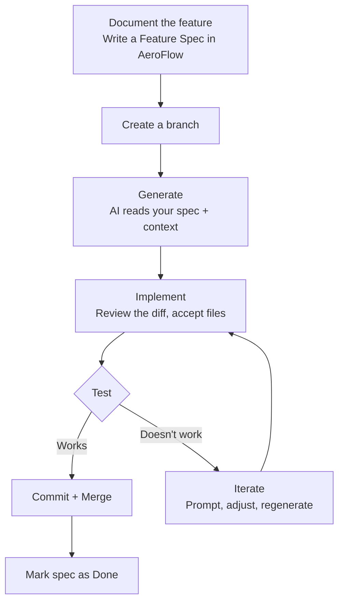
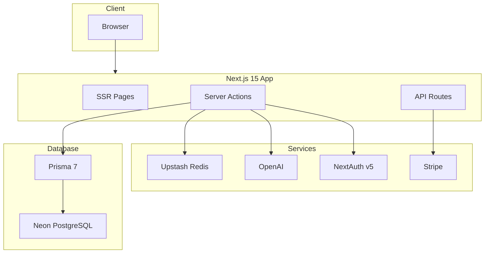

# ⚡ AeroFlow

> **Your specs take flight.**
> The AI workflow manager for developers who build with AI.


---

## The Problem

Every time you open Claude, Cursor, or ChatGPT to work on a project — you start from zero.

You re-explain your stack. You re-paste your coding standards. You hunt through old chat histories for that prompt that worked perfectly last week. You copy your project overview from a random markdown file buried in your repo.

**Developers who build with AI waste more time re-explaining their projects than actually building.**

---

## The Solution

AeroFlow is a guided workspace where your AI workflow lives.

Store your prompts, context files, and feature specs in one place. Attach them to AI runs with one click. Watch your specs take flight — from idea to scaffolded code, without starting from scratch every time.

```
Without AeroFlow                    With AeroFlow
─────────────────────               ──────────────────────────
Open Claude                         Open AeroFlow
Re-explain your stack         →     Select your project context
Re-paste coding standards     →     Attach your standards file
Re-write your prompt          →     Select your saved prompt
Hope the output fits          →     Hit Run — it already knows
Fix everything that's wrong         Review and accept
```

---

## How It Works


---

## Item Types

AeroFlow organizes everything into 5 item types:

| Type | Color | What it is |
|---|---|---|
| ⚡ **Prompt** | Purple | A reusable AI prompt. Versioned, runnable, with output history. |
| 📄 **Context File** | Blue | Project overviews, coding standards, architectural decisions. |
| 🗂️ **Feature Spec** | Orange | Structured spec with requirements, stack, and status. Drives the Generate flow. |
| 🧩 **Template** | Emerald | Reusable code patterns and boilerplate structures. |
| 🔗 **Resource Link** | Indigo | Docs, tools, and references you always need but always lose. |

---

## The AI Workflow

AeroFlow is built around the same workflow developers already use — but makes every step faster and smarter.



---

## Core Features

### Free
- Store unlimited prompts, context files, specs, templates, and links
- Organize into collections
- Global search across everything
- AI auto-tagging

### Pro
- **Prompt Runner** — Select a prompt, attach context files, run it. Output appears inline. Save results as new items.
- **Prompt Diff** — Run a prompt before and after edits. See both outputs side by side. Keep the better one.
- **Generate** — Write a Feature Spec, hit Generate, get scaffolded code that matches your actual project conventions.
- **AI Spec Writer** — Describe a feature in plain English. AeroFlow drafts the structured spec for you.

---

## Tech Stack

| Category | Technology |
|---|---|
| Framework | Next.js 15 + React 19 |
| Language | TypeScript (strict) |
| Database | Neon PostgreSQL + Prisma 7 |
| Auth | NextAuth v5 (email + GitHub OAuth) |
| AI | OpenAI GPT-4o Mini |
| Styling | Tailwind CSS v4 + shadcn/ui |
| Payments | Stripe (monthly + yearly) |
| Rate Limiting | Upstash Redis |
| Deployment | Vercel |

---

## Architecture



---

## Project Structure

```
aeroflow/
├── prisma/
│   ├── schema.prisma
│   └── migrations/
├── src/
│   ├── app/
│   │   ├── (auth)/          # Login, register
│   │   ├── (dashboard)/     # Main app
│   │   │   ├── items/
│   │   │   ├── collections/
│   │   │   └── runner/      # Prompt Runner (Pro)
│   │   └── api/
│   │       ├── ai/          # Run, generate, autotag
│   │       └── webhooks/
│   ├── components/
│   ├── actions/             # Server actions
│   └── lib/
├── context/                 # AI context files for development
│   ├── project-overview.md
│   └── coding-standards.md
└── CLAUDE.md
```

---

## Status

AeroFlow is actively under development.

| Feature | Status |
|---|---|
| Project setup + Next.js scaffold | ✅ Done |
| Database schema (Prisma + Neon) | 🔄 In progress |
| Authentication (NextAuth v5) | 🔜 Up next |
| Item CRUD (all 5 types) | 🔜 Planned |
| Collections | 🔜 Planned |
| Prompt Runner | 🔜 Planned |
| Generate (code scaffolding) | 🔜 Planned |
| Stripe billing | 🔜 Planned |
| Deployment | 🔜 Planned |

---

## Getting Started (Local Development)

```bash
# Clone the repo
git clone https://github.com/lerenah/AeroFlow.git
cd AeroFlow

# Install dependencies
npm install

# Set up environment variables
cp .env.example .env.local

# Run the development server
npm run dev
```

Open [http://localhost:3000](http://localhost:3000).

---

## Environment Variables

```env
# Database
DATABASE_URL=

# Auth
NEXTAUTH_SECRET=
NEXTAUTH_URL=

# GitHub OAuth
GITHUB_CLIENT_ID=
GITHUB_CLIENT_SECRET=

# OpenAI
OPENAI_API_KEY=

# Stripe
STRIPE_SECRET_KEY=
STRIPE_PUBLISHABLE_KEY=
STRIPE_WEBHOOK_SECRET=

# Upstash Redis
UPSTASH_REDIS_REST_URL=
UPSTASH_REDIS_REST_TOKEN=
```

---

## Roadmap

- [ ] Core item CRUD
- [ ] Collections
- [ ] Global search
- [ ] Auth + GitHub OAuth
- [ ] Stripe free/pro gating
- [ ] Prompt Runner
- [ ] Prompt Diff view
- [ ] Generate (flagship feature)
- [ ] Onboarding wizard
- [ ] CLI companion tool

---

## Contributing

AeroFlow is open source and contributions are welcome. See [CONTRIBUTING.md](./CONTRIBUTING.md) for guidelines.

---

## License

MIT — see [LICENSE](./LICENSE)

---

*Built by [Lerena Holloway](https://github.com/lerenah) · AeroFlow — Your specs take flight.*