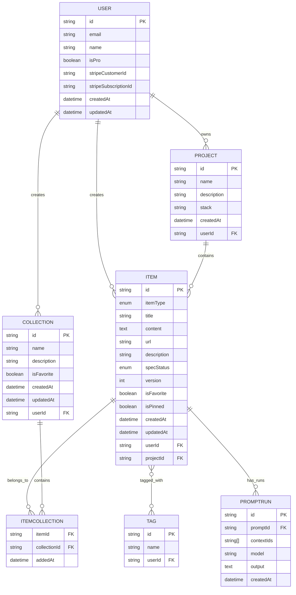
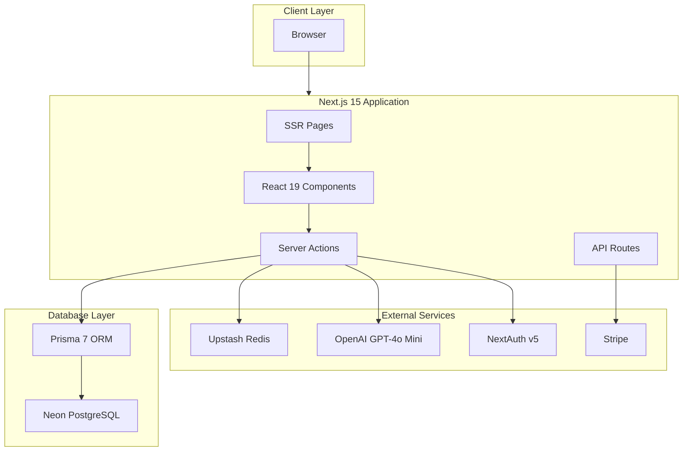
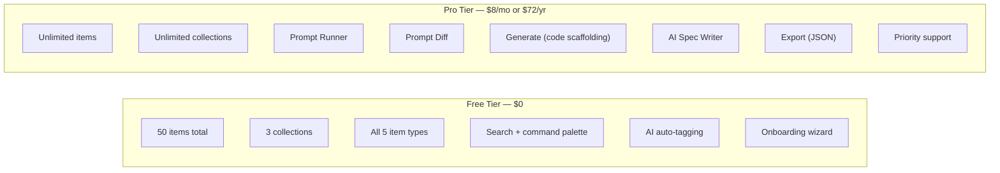

# AeroFlow - Project Overview

> Your specs take flight. — The guided AI workflow manager for developers who build with AI.

---

## 📋 Table of Contents

- [Problem Statement](#-problem-statement)
- [Target Users](#-target-users)
- [Features](#-features)
- [Onboarding Wizard](#-onboarding-wizard)
- [Data Architecture](#-data-architecture)
- [Tech Stack](#-tech-stack)
- [Monetization](#-monetization)
- [UI/UX Guidelines](#-uiux-guidelines)

---

## 🎯 Problem Statement

Developers who build with AI tools like Claude, Cursor, and ChatGPT face the same problem every session:

| Asset | Where it lives today |
| --- | --- |
| AI prompts | Scattered across chat histories |
| Project context | Buried in individual project folders |
| Coding standards | Copy-pasted manually into every conversation |
| Feature specs | Random markdown files in git repos |
| Workflow patterns | Rebuilt from memory each time |

**The result:** Every new AI conversation starts from zero. Every new project means re-explaining your stack, your conventions, your patterns — again.

**The closest thing developers have today:** The "Projects" feature in Claude.ai — where you paste in context files and the AI remembers them for that session. AeroFlow is what that experience looks like if someone built a proper, dedicated tool around it. Versioned. Searchable. Runnable. Working across any AI tool.

**The solution:** AeroFlow is a guided workspace where your AI workflow assets live permanently — prompts, context files, feature specs, and templates — organized, versioned, and executable. The signature feature: write a Feature Spec, attach your Context Files, hit **Generate**, and AeroFlow scaffolds the actual code files that match your project's conventions.

**Your specs don't just sit there. They take flight.**

---

## 👥 Target Users

| User Type | Primary Needs |
| --- | --- |
| **AI-First Developer** | Store, version, and run prompts across projects without losing history |
| **Full-Stack Builder** | Write feature specs and generate scaffolded code that matches their existing codebase |
| **Team Lead / Architect** | Maintain shared coding standards and context files the whole team pulls from |
| **Freelancer / Consultant** | Switch between client projects without re-explaining each codebase from scratch |
| **Developers learning AI workflows** | Get guided through the right way to structure context before prompting |

---

## ✨ Features

### A. Onboarding Wizard (Signature UX Feature)

AeroFlow's first-time experience is a **guided setup wizard** — not a blank dashboard. This is what makes AeroFlow a workflow tool, not just a notes app.

The wizard walks new users through:

1. **Create your Project Context** — describe your stack, or hit "Generate with AI" to have AeroFlow write the context file from a plain-English description
2. **Add your Coding Standards** — type your rules or let the AI ask you a few questions and draft them
3. **Save your first Prompt** — AeroFlow ships with a library of starter prompts; customize or use as-is
4. **You're ready** — workspace configured, context saved, ready to ship


The wizard is not one-time only. It runs every time a user creates a new **Project** inside AeroFlow — because developers work across multiple projects and every one needs its own context.

### B. Items & Item Types

Items are the core unit of AeroFlow. Each item has a type that determines its behavior and what the AI can do with it.

#### System Types (Immutable)

| Type | Icon | Color | Description | Route |
| --- | --- | --- | --- | --- |
| ⚡ Prompt | `Sparkles` | `#8b5cf6` (purple) | A reusable AI prompt. Versioned, runnable, with full output history. | `/items/prompts` |
| 📄 Context File | `FileText` | `#3b82f6` (blue) | Project overviews, coding standards, architectural decisions. Attached to runs. | `/items/context` |
| 🗂️ Feature Spec | `ClipboardList` | `#f97316` (orange) | Structured spec: title, requirements, stack, status. Drives the Generate flow. | `/items/specs` |
| 🧩 Template | `Layout` | `#10b981` (emerald) | Reusable code structures and boilerplate patterns. | `/items/templates` |
| 🔗 Resource Link | `Link` | `#6366f1` (indigo) | Docs, references, tools — the useful URL you always lose. | `/items/links` |

> **Note:** File and image uploads are intentionally excluded from MVP. They add infrastructure complexity (Cloudflare R2) without serving AeroFlow's core workflow thesis. Planned for V2.

### C. Collections

Users organize items into named collections. Items support many-to-many collection membership.

**Examples:**
- React Project (context files, prompts, feature specs)
- Auth Patterns (templates, prompts)
- Client: Acme Corp (context files, specs, links)
- Interview Prep (prompts, templates)

### D. Search

Full-text search across titles, content, tags, types, and spec status. Command palette via `⌘K`.

### E. Authentication

- Email/password
- GitHub OAuth
- Powered by NextAuth v5

### F. Core Features

- ⭐ Favorite items and collections
- 📌 Pin items to top
- 🕐 Recently used items
- ✍️ Markdown editor for all text items
- 🌙 Dark mode (default)
- 💾 Export data (JSON)
- 🏷️ AI auto-tagging (free)
- 👁️ Collection membership view per item

### G. AI Features

#### Free
- 🏷️ **AI auto-tag** — Suggest tags based on item title and content

#### Pro Only

- ▶️ **Prompt Runner** — Select a Prompt, attach Context Files, hit Run. AI output appears inline. Save the result as a new item. This is the core power feature.

- 🔀 **Prompt Diff** — Run a prompt, edit it, run again. Both outputs shown side by side. Keep the better version. Make your prompts measurably better over time.

- ⚙️ **Generate** — Write a Feature Spec, attach Context Files, hit Generate. AeroFlow produces scaffolded code — component, server action, schema update, types — that follows your actual project conventions and imports from your real files. Output shown as a reviewable diff before anything is accepted.

- 📝 **AI Spec Writer** — Describe a feature in plain English. AeroFlow drafts a structured Feature Spec for you to review and edit. Removes the blank-page problem before generating.

---

## 🧭 Onboarding Wizard

The wizard is a critical differentiator. It turns AeroFlow from "a place to store stuff if you know what to store" into "a tool that teaches developers how to work with AI properly, then remembers everything."

### Wizard Flow

```
Step 1 — Name your project
         ↓
Step 2 — Describe your stack
         Type it, OR hit "Generate with AI"
         AI asks: framework? language? database? patterns?
         Drafts the Context File for you to review
         ↓
Step 3 — Add coding standards
         Type rules, OR hit "Generate"
         AI drafts: naming, file structure, component patterns, etc.
         ↓
Step 4 — Save your first prompt
         Choose from starter library, OR write your own
         Recommended: "Generate a feature slice for: {feature}"
         ↓
Step 5 — Done
         "Your workspace is ready. Open a Feature Spec to start building."
```

### The Embedded AI Assistant (Wizard Only)

The wizard contains a small focused AI chat — not a general chatbot. Its only job is helping you build your workspace:

> "What framework are you using?"
> "Do you use server actions or API routes?"
> "Here's a draft of your context file. Edit anything that's wrong."

This is scoped and purposeful. It disappears after onboarding. This distinction keeps AeroFlow from feeling like a ChatGPT wrapper.

---

## 🗄️ Data Architecture

### Entity Relationship Diagram



### Prisma Schema

```prisma
// prisma/schema.prisma

generator client {
  provider = "prisma-client-js"
}

datasource db {
  provider = "postgresql"
  url      = env("DATABASE_URL")
}

// ============================================
// USER
// ============================================
model User {
  id                   String    @id @default(cuid())
  email                String    @unique
  emailVerified        DateTime?
  name                 String?
  image                String?
  password             String?
  isPro                Boolean   @default(false)
  stripeCustomerId     String?   @unique
  stripeSubscriptionId String?   @unique
  createdAt            DateTime  @default(now())
  updatedAt            DateTime  @updatedAt

  items       Item[]
  collections Collection[]
  projects    Project[]
  tags        Tag[]
  accounts    Account[]
  sessions    Session[]

  @@map("users")
}

// ============================================
// NEXTAUTH MODELS
// ============================================
model Account {
  id                String  @id @default(cuid())
  userId            String
  type              String
  provider          String
  providerAccountId String
  refresh_token     String? @db.Text
  access_token      String? @db.Text
  expires_at        Int?
  token_type        String?
  scope             String?
  id_token          String? @db.Text
  session_state     String?

  user User @relation(fields: [userId], references: [id], onDelete: Cascade)

  @@unique([provider, providerAccountId])
  @@map("accounts")
}

model Session {
  id           String   @id @default(cuid())
  sessionToken String   @unique
  userId       String
  expires      DateTime

  user User @relation(fields: [userId], references: [id], onDelete: Cascade)

  @@map("sessions")
}

model VerificationToken {
  identifier String
  token      String   @unique
  expires    DateTime

  @@unique([identifier, token])
  @@map("verification_tokens")
}

// ============================================
// PROJECT (workspace grouping)
// ============================================
model Project {
  id          String   @id @default(cuid())
  name        String
  description String?  @db.Text
  stack       String?  @db.Text  // Plain text description of the stack
  createdAt   DateTime @default(now())
  updatedAt   DateTime @updatedAt

  userId String
  user   User   @relation(fields: [userId], references: [id], onDelete: Cascade)
  items  Item[]

  @@index([userId])
  @@map("projects")
}

// ============================================
// ITEM
// ============================================
enum ItemType {
  PROMPT
  CONTEXT_FILE
  FEATURE_SPEC
  TEMPLATE
  RESOURCE_LINK
}

enum SpecStatus {
  NOT_STARTED
  IN_PROGRESS
  DONE
}

model Item {
  id          String     @id @default(cuid())
  itemType    ItemType
  title       String
  content     String?    @db.Text
  url         String?                       // RESOURCE_LINK type only
  description String?    @db.Text
  specStatus  SpecStatus?                   // FEATURE_SPEC type only
  version     Int        @default(1)        // PROMPT type — increments on edit
  isFavorite  Boolean    @default(false)
  isPinned    Boolean    @default(false)
  createdAt   DateTime   @default(now())
  updatedAt   DateTime   @updatedAt

  userId     String
  user       User        @relation(fields: [userId], references: [id], onDelete: Cascade)
  projectId  String?
  project    Project?    @relation(fields: [projectId], references: [id], onDelete: SetNull)
  tags       Tag[]       @relation("ItemTags")
  collections ItemCollection[]
  promptRuns  PromptRun[] @relation("PromptRuns")

  @@index([userId])
  @@index([itemType])
  @@index([projectId])
  @@index([createdAt])
  @@map("items")
}

// ============================================
// PROMPT RUN (history of AI executions)
// ============================================
model PromptRun {
  id         String   @id @default(cuid())
  promptId   String
  contextIds String[] // IDs of context file items attached to this run
  model      String   @default("gpt-4o-mini")
  output     String   @db.Text
  createdAt  DateTime @default(now())

  prompt Item @relation("PromptRuns", fields: [promptId], references: [id], onDelete: Cascade)

  @@index([promptId])
  @@map("prompt_runs")
}

// ============================================
// COLLECTION
// ============================================
model Collection {
  id          String   @id @default(cuid())
  name        String
  description String?  @db.Text
  isFavorite  Boolean  @default(false)
  createdAt   DateTime @default(now())
  updatedAt   DateTime @updatedAt

  userId String
  user   User   @relation(fields: [userId], references: [id], onDelete: Cascade)
  items  ItemCollection[]

  @@index([userId])
  @@map("collections")
}

// ============================================
// ITEM-COLLECTION JOIN TABLE
// ============================================
model ItemCollection {
  itemId       String
  collectionId String
  addedAt      DateTime @default(now())

  item       Item       @relation(fields: [itemId], references: [id], onDelete: Cascade)
  collection Collection @relation(fields: [collectionId], references: [id], onDelete: Cascade)

  @@id([itemId, collectionId])
  @@map("item_collections")
}

// ============================================
// TAG
// ============================================
model Tag {
  id     String @id @default(cuid())
  name   String
  userId String
  user   User   @relation(fields: [userId], references: [id], onDelete: Cascade)
  items  Item[] @relation("ItemTags")

  @@unique([name, userId])
  @@map("tags")
}
```

### Seed Data

```typescript
// prisma/seed.ts
import { PrismaClient } from '@prisma/client';

const prisma = new PrismaClient();

async function main() {
  console.log('No global seed data needed — item types are enums, not database rows.');
  console.log('Seed this file with a demo user and sample items for local development.');
}

main()
  .catch((e) => { console.error(e); process.exit(1); })
  .finally(async () => { await prisma.$disconnect(); });
```

---

## 🛠️ Tech Stack

### Architecture Diagram



### Technology Choices

| Category | Technology | Notes |
| --- | --- | --- |
| **Framework** | Next.js 15 / React 19 | SSR, server actions, single codebase |
| **Language** | TypeScript (strict) | No `any`, explicit types throughout |
| **Database** | Neon PostgreSQL | Serverless Postgres, dev + prod branches |
| **ORM** | Prisma 7 | Always use migrations, never `db push` |
| **Authentication** | NextAuth v5 | Email/password + GitHub OAuth |
| **AI** | OpenAI GPT-4o Mini | Prompt runner, generate, auto-tag, wizard |
| **Styling** | Tailwind CSS v4 + shadcn/ui | CSS-only config, dark mode first |
| **Payments** | Stripe | Monthly ($8) + yearly ($72) subscriptions |
| **Rate Limiting** | Upstash Redis | Per-user limits on all AI features |
| **Deployment** | Vercel | Preview deploys, edge-optimized |

### Critical Development Rules

> ⚠️ **Tailwind v4 — NO config file**
> Do NOT create `tailwind.config.ts` or `tailwind.config.js`. All theme config lives in `src/app/globals.css` using the `@theme` directive.

> ⚠️ **Database Migrations Only**
> NEVER use `prisma db push`. Always:
> ```bash
> npx prisma migrate dev --name <migration_name>   # development
> npx prisma migrate deploy                          # production
> ```

> ⚠️ **Server Actions over API Routes**
> Use server actions for all form submissions and mutations. Only use API routes for webhooks (Stripe), file uploads with progress, and third-party integrations.

### Recommended Links

- [Next.js Docs](https://nextjs.org/docs)
- [Prisma 7 Upgrade Guide](https://www.prisma.io/docs/orm/more/upgrade-guides/upgrading-versions/upgrading-to-prisma-7)
- [NextAuth v5 Docs](https://authjs.dev)
- [Tailwind CSS v4](https://tailwindcss.com/docs)
- [shadcn/ui](https://ui.shadcn.com)
- [Neon PostgreSQL](https://neon.tech/docs)
- [Stripe Subscriptions](https://stripe.com/docs/billing/subscriptions)
- [Upstash Redis](https://upstash.com/docs/redis)

---

## 💰 Monetization

### Pricing Tiers



### Feature Comparison

| Feature | Free | Pro |
| --- | :---: | :---: |
| Items | 50 | Unlimited |
| Collections | 3 | Unlimited |
| All 5 item types | ✅ | ✅ |
| Onboarding wizard | ✅ | ✅ |
| Search + command palette | ✅ | ✅ |
| Favorites and pins | ✅ | ✅ |
| AI auto-tagging | ✅ | ✅ |
| Prompt Runner | ❌ | ✅ |
| Prompt Diff | ❌ | ✅ |
| Generate (code scaffolding) | ❌ | ✅ |
| AI Spec Writer | ❌ | ✅ |
| Data export (JSON) | ❌ | ✅ |
| Priority support | ❌ | ✅ |

> **Development Note:** All features are accessible during development. Pro gating enabled before launch.

---

## 🎨 UI/UX Guidelines

### Design Principles

- **Dark mode first** — Developers live in dark mode. Light mode is secondary.
- **Speed over decoration** — Every interaction should feel instant. No unnecessary animations.
- **Developer aesthetic** — Clean, minimal, dense. Inspired by Linear, Raycast, VS Code.
- **Guided, not prescriptive** — The wizard helps but never forces a workflow.
- **Syntax highlighting everywhere** — All code and prompt content renders highlighted.

### Design References

- [Linear](https://linear.app) — Speed, keyboard-first, clean sidebar
- [Raycast](https://raycast.com) — Command palette, quick-access patterns
- [Notion](https://notion.so) — Flexible content organization

### Layout Structure

```
┌─────────────────────────────────────────────────────────────┐
│  ⚡ AeroFlow                              🔍  ⚙️  👤        │
├──────────────┬──────────────────────────────────────────────┤
│              │                                              │
│  TYPES       │  My Projects                                 │
│  ─────────   │  ┌──────────┐ ┌──────────┐ ┌──────────┐    │
│  ⚡ Prompts  │  │  React   │ │  Client  │ │  Auth    │    │
│  📄 Context  │  │ Project  │ │ Acme Corp│ │ Patterns │    │
│  🗂️ Specs   │  └──────────┘ └──────────┘ └──────────┘    │
│  🧩 Templates│                                              │
│  🔗 Links    │  Recent Items                                │
│              │  ┌────────────────────────────────────────┐ │
│  ─────────   │  │ ⚡ Code review prompt          v3  ▶   │ │
│  COLLECTIONS │  ├────────────────────────────────────────┤ │
│  React...    │  │ 🗂️ User auth spec         IN PROGRESS  │ │
│  Acme Corp.. │  ├────────────────────────────────────────┤ │
│  Auth...     │  │ 📄 Next.js coding standards            │ │
│              │  └────────────────────────────────────────┘ │
└──────────────┴──────────────────────────────────────────────┘
```

### Type Colors

```css
@theme {
  --color-prompt:        #8b5cf6;  /* Purple  */
  --color-context:       #3b82f6;  /* Blue    */
  --color-spec:          #f97316;  /* Orange  */
  --color-template:      #10b981;  /* Emerald */
  --color-resource-link: #6366f1;  /* Indigo  */
}
```

### Icon Mapping (Lucide React)

```typescript
// src/lib/constants/item-types.ts
import { Sparkles, FileText, ClipboardList, Layout, Link } from 'lucide-react';

export const ITEM_TYPE_CONFIG = {
  PROMPT: {
    icon: Sparkles,
    color: '#8b5cf6',
    label: 'Prompt',
    description: 'Reusable AI prompt',
  },
  CONTEXT_FILE: {
    icon: FileText,
    color: '#3b82f6',
    label: 'Context File',
    description: 'Project context and standards',
  },
  FEATURE_SPEC: {
    icon: ClipboardList,
    color: '#f97316',
    label: 'Feature Spec',
    description: 'Structured feature requirement',
  },
  TEMPLATE: {
    icon: Layout,
    color: '#10b981',
    label: 'Template',
    description: 'Reusable code pattern',
  },
  RESOURCE_LINK: {
    icon: Link,
    color: '#6366f1',
    label: 'Resource Link',
    description: 'Docs, tools, references',
  },
} as const;
```

### Responsive Behavior

| Viewport | Sidebar | Layout |
| --- | --- | --- |
| Desktop (≥1024px) | Visible, collapsible | Full sidebar + main content |
| Tablet (768–1023px) | Drawer, hidden by default | Full-width content |
| Mobile (<768px) | Drawer, hidden by default | Stacked cards |

### Micro-interactions

- Transitions: 150–200ms ease
- Hover states: subtle border color shift on cards
- Toast notifications: CRUD actions and AI completions
- Skeleton loading: all async content
- Drawer: slide-in for item editing
- Run button: pulse while AI is generating

---

## 📁 Project Structure

```
aeroflow/
├── prisma/
│   ├── schema.prisma
│   ├── migrations/
│   └── seed.ts
├── src/
│   ├── app/
│   │   ├── (auth)/
│   │   │   ├── login/
│   │   │   └── register/
│   │   ├── (dashboard)/
│   │   │   ├── items/
│   │   │   │   └── [type]/
│   │   │   ├── collections/
│   │   │   │   └── [id]/
│   │   │   ├── projects/
│   │   │   │   └── [id]/
│   │   │   ├── runner/           ← Prompt Runner (Pro)
│   │   │   └── settings/
│   │   ├── api/
│   │   │   ├── items/
│   │   │   ├── collections/
│   │   │   ├── ai/
│   │   │   │   ├── run/          ← Prompt Runner endpoint
│   │   │   │   ├── generate/     ← Code generation endpoint
│   │   │   │   ├── autotag/
│   │   │   │   └── spec-writer/  ← AI Spec Writer endpoint
│   │   │   └── webhooks/
│   │   │       └── stripe/
│   │   ├── layout.tsx
│   │   └── page.tsx
│   ├── components/
│   │   ├── ui/                   ← shadcn components
│   │   ├── items/
│   │   ├── collections/
│   │   ├── projects/
│   │   ├── runner/               ← Prompt Runner UI
│   │   ├── wizard/               ← Onboarding wizard
│   │   ├── layout/
│   │   └── shared/
│   ├── actions/
│   │   ├── items.ts
│   │   ├── collections.ts
│   │   ├── projects.ts
│   │   ├── ai.ts
│   │   └── stripe.ts
│   ├── lib/
│   │   ├── prisma.ts
│   │   ├── auth.ts
│   │   ├── stripe.ts
│   │   ├── openai.ts
│   │   ├── usage.ts              ← Free tier limit checks
│   │   ├── rate-limit.ts         ← Upstash Redis config
│   │   └── constants/
│   │       └── item-types.ts
│   ├── hooks/
│   ├── types/
│   └── styles/
│       └── globals.css
├── context/                      ← AI context files (this folder)
│   ├── project-overview.md       ← This file
│   ├── coding-standards.md
│   ├── ai-interaction.md
│   └── current-feature.md
├── public/
├── CLAUDE.md
├── .env.example
├── next.config.ts
├── tsconfig.json
└── package.json
```

---

## 🚀 Build Order

1. [ ] Context files + CLAUDE.md setup
2. [ ] Neon PostgreSQL + Prisma 7 schema + initial migration
3. [ ] NextAuth v5 — email/password + GitHub OAuth
4. [ ] shadcn/ui setup + base layout (sidebar, topbar)
5. [ ] **DIVERGE FROM DEVSTASH HERE**
6. [ ] Item CRUD for all 5 AeroFlow types
7. [ ] Collections + item-collection relationships
8. [ ] Projects + onboarding wizard
9. [ ] Global search / command palette (⌘K)
10. [ ] Upstash Redis + rate limiting
11. [ ] Stripe free/pro gating
12. [ ] AI auto-tagging (free feature)
13. [ ] Prompt Runner (Pro)
14. [ ] Prompt Diff view (Pro)
15. [ ] Generate flow (Pro — flagship feature)
16. [ ] AI Spec Writer (Pro)
17. [ ] Homepage + marketing page
18. [ ] Testing, polish, deployment to Vercel

---

*Last updated: April 2025*
*Stack: Next.js 15 · TypeScript · Prisma 7 · Neon · NextAuth v5 · OpenAI · Stripe · Upstash · Vercel*